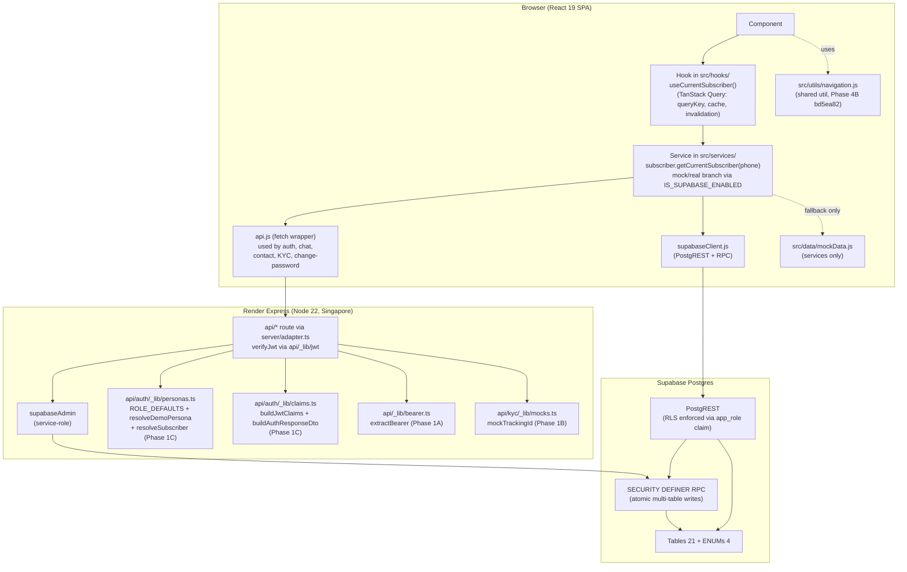

# ARCHITECTURE.md — Universal Pensions Uganda

System architecture for the Uganda Pensions demo platform: the patterns and boundaries that hold across the React app, the Vercel serverless API, and the Supabase database. This doc is **about how the pieces fit together** — not file-level detail. For file-level inventories, see [`FRONTEND.md`](./FRONTEND.md) and [`BACKEND.md`](./BACKEND.md); for the slim orientation index, see [`CLAUDE.md`](../CLAUDE.md).

> **Scope note.** Uganda Pensions is a **sales-rep demo**, not a production fintech. Many decisions captured below (custom HS256 JWT with no refresh, demo-persona fallback IDs, hardcoded UGX 1,000 unit price, mocked KYC/SMS/chat, per-session mutation stores) are intentional demo affordances. The demo silences and fallbacks called out in §4 are explicitly **by design** — proposing real SMS/payment/KYC/audit/compliance integrations is out of scope per [`CLAUDE.md §10a`](../CLAUDE.md).

> **Post-cleanup state.** This document reflects the platform as of branch `cleanup/post-audit-2026-05-26` (May 2026). The cleanup sprint closed F1, F22, D10, D11 alongside Phases 1, 2, 4, and 7 structural changes — captured throughout below as inline references to the commit SHAs that landed each change.

---

## 1. One-page system diagram

The platform is a thin, three-tier stack with a deliberately narrow contract between every pair of layers. Read top-to-bottom:

```
┌─────────────────────────────────────────────────────────────────────────────┐
│                              Browser tab                                    │
│  ┌───────────────────────────────────────────────────────────────────────┐  │
│  │  React 19 SPA (Vite 6.3.5, CSS Modules, alias `@` → `./src`)          │  │
│  │  ─────────────────────────────────────────────────────────────────    │  │
│  │  4 role-scoped dashboard shells (subscriber, agent, branch,           │  │
│  │  distributor) under `src/{subscriber,agent,branch}-dashboard/` +      │  │
│  │  `src/dashboard/` for the distributor. Shared shell:                  │  │
│  │  `src/components/` + `src/contexts/` + design tokens (`src/index.css`)│  │
│  │  Signup flow: `src/signup/`  (KYC steps + contribution sub-flow)      │  │
│  │                                                                       │  │
│  │  Data layer (top → bottom):                                           │  │
│  │     components → hooks (`src/hooks/`, TanStack Query 5)               │  │
│  │                   ↓                                                   │  │
│  │                 services (`src/services/`, 11 files)                  │  │
│  │                   ↓                                                   │  │
│  │     ┌─── `api.js` (fetch wrapper, JWT injection, 401 → onAuthExpired) │  │
│  │     └─── `supabaseClient.js` (PostgREST + Realtime + RPC)             │  │
│  │                                                                       │  │
│  │  Cross-cutting utils: `src/utils/navigation.js` (Phase 4B `bd5ea82`), │  │
│  │  `finance.js`, `date.js`, `currency.js`, `csv.js`, `phone.js`,        │  │
│  │  `xlsx.js`, `settlement.js`, `commissionMonths.js`,                   │  │
│  │  `motion.js` (EASE_OUT_EXPO), `dashboard.js`.                         │  │
│  └───────────────┬───────────────────────────────┬───────────────────────┘  │
│       Authorization: Bearer <jwt>     Authorization: Bearer <jwt>           │
│                   │                       + apikey: <anon_key>              │
└───────────────────┼───────────────────────────────┼─────────────────────────┘
                    │                               │
                    ▼                               ▼
       ┌─────────────────────────────┐  ┌──────────────────────────────────┐
       │ Render Web Service          │  │   Supabase PostgREST + Realtime  │
       │ Express 5 / Node 22 / Sing. │  │   (rest/v1 + realtime channels)  │
       │ server/index.ts mounts      │  │                                  │
       │ api/*.ts (TypeScript)       │  │   Reads: anon client via SDK     │
       │ • api/auth/* — 4            │  │   Writes: never direct — every   │
       │   (send-otp, verify-otp,    │  │     write goes through a         │
       │    verify-password,         │  │     SECURITY DEFINER RPC         │
       │    change-password)         │  │                                  │
       │ • api/kyc/*  — 8 (mocked)   │  │                                  │
       │ • api/chat.ts               │  │                                  │
       │ • api/contact.ts            │  │                                  │
       │                             │  │                                  │
       │ Shared helpers:             │  │                                  │
       │ • api/_lib/      (jwt,      │  │                                  │
       │   supabase-admin, bearer,   │  │                                  │
       │   phone, withAuth,          │  │                                  │
       │   withOptionalAuth)         │  │                                  │
       │ • api/auth/_lib/            │  │                                  │
       │   (personas, claims,        │  │                                  │
       │    password)  [Phase 1C]    │  │                                  │
       │ • api/kyc/_lib/             │  │                                  │
       │   (mocks — Smile ID shape)  │  │                                  │
       └──────────┬──────────────────┘  └──────────────┬───────────────────┘
                  │ supabase-admin                       │ enforces RLS via
                  │ (service-role key —                 │ auth.jwt() claims
                  │  bypasses RLS,                       │
                  │  used to mint JWT,                   │
                  │  insert contact + referrals)         │
                  ▼                                      ▼
         ┌─────────────────────────────────────────────────────────────────┐
         │                Supabase Postgres (single project)               │
         │  28 tables · 2 ENUMs · pg_trgm · 5 triggers                     │
         │  40 functions (29 SECURITY DEFINER + 11 INVOKER)                │
         │  ~90 RLS policies (zero `auth.uid()` calls — all read app_role) │
         │  supabase_realtime publication: empty (no tables)               │
         │                                                                 │
         │  57 migrations on the new DB (cutover 2026-06-05):              │
         │    0001 → 0057 inclusive (0019 backfilled, no longer            │
         │    skipped). New Singapore DB — no ledger drift. See §13.       │
         └─────────────────────────────────────────────────────────────────┘
```

**The three crossings, in one line each:**

- **Browser → API.** Cross-origin `https://uganda-dashboard-api.onrender.com/api/*` fetch from `src/services/api.js` (URL baked at Vite build time via `VITE_API_BASE_URL`), carrying a custom HS256 JWT in the `Authorization: Bearer` header. CORS allowlist on the Render side covers production + Vercel preview + Vite dev origins.
- **Browser → PostgREST.** `supabase-js` over the anon key + the same custom JWT; reads only (every write would be blocked by RLS without a server-side helper).
- **API → DB.** Express on Render uses the singleton `supabase-admin` (service-role key) which **bypasses RLS**. Used for JWT-mint lookups, contact-form writes, and KYC-referral writes. The admin client's `auth.persistSession: false` is mandatory under a long-lived process (see BACKEND.md §4).

Everything else is a refinement of those three boundaries.

---

## 2. Layered architecture

Inside each tier, the work splits into layers with a single responsibility each. The full read/write path for "a subscriber sees their balance" is:



**Why each layer exists:**

| Layer | Purpose | What crosses it | What does NOT cross it |
|---|---|---|---|
| Component / page | Compose UI; bind to hooks | Render data, dispatch user intent | Cache state, fetch primitives, mock data |
| Hook (`src/hooks/`) | Cache shape + invalidation rules; mutation orchestration | TanStack Query keys; `onSuccess` invalidations | `fetch()`, Supabase client, mock data imports |
| Service (`src/services/`) | Backend-shape translation + rollback flag (mock branch) | Backend rows ↔ camelCase UI shapes; `IS_SUPABASE_ENABLED` branch | Component refs, hook state, React context |
| `api.js` / `supabaseClient.js` | Transport primitives | HTTP / PostgREST / RPC calls; auth header injection; 401 propagation | Domain knowledge, optimistic updates |
| Shared util (`src/utils/`) | Pure helpers that any role may import | `goBackOrFallback`, `formatUGX`, `formatDate`, `EASE_OUT_EXPO`, frequency normalisation | Component refs, React state, hooks |
| Express handler (`api/`, mounted by `server/index.ts`) | Server-side enforcement (signing, RLS bypass) | Validated body → `supabaseAdmin` → response envelope | Frontend state, React imports |
| API helper (`api/_lib`, `api/auth/_lib`, `api/kyc/_lib`) | Cross-route logic with one home | JWT mint, persona resolution, bearer parsing, KYC mocks | Per-route handler-specific state |
| RPC (SECURITY DEFINER) | Atomic multi-table writes; business invariants | Multiple table mutations in one transaction; role check via `auth.jwt() ->> 'app_role'` | Untrusted input without `_validate_signup_payload` |
| Table | Storage + RLS check | Row data | Direct client writes (RLS blocks everything that isn't an RPC) |

The layering is **not** decorative — each boundary blocks a class of mistake. Components can't accidentally hit `fetch`. Hooks can't accidentally hit `mockData`. The API can't accidentally write through the anon path. RLS can't accidentally trust the wrong JWT claim (see §3 + §6).

**Post-cleanup additions in this layer cake:**

- `src/utils/navigation.js` — Promoted from `src/subscriber-dashboard/shell/navigation.js` so the agent dashboard's `PageHeader` can consume `goBackOrFallback` without reaching across role folders (Phase 4B `bd5ea82`, F1/F22). See §6.
- `api/_lib/bearer.ts` — Single home for `Authorization: Bearer <token>` parsing; consumed by `withAuth`, `withOptionalAuth`, and `change-password.ts` (Phase 1A `aab34e9`, B6).
- `api/auth/_lib/personas.ts` — `ROLE_DEFAULTS`, `resolveSubscriber`, `resolveDemoPersona` (Phase 1C `c3b54a3`, B8/B9/D18).
- `api/auth/_lib/claims.ts` — `buildJwtClaims` + `buildAuthResponseDto` (Phase 1C `c3b54a3`, D18). Guarantees byte-identical JWT and DTO shape between OTP and password flows.
- `api/kyc/_lib/mocks.ts` — `mockTrackingId` so KYC routes share one canonical Smile-ID-shaped tracking ID generator (Phase 1B `92cada2`, B7).

---

## 3. Auth & session model — post-password-rollout

The OTP-only flow was joined by a parallel password flow in early 2026. Both flows mint **byte-identical JWT claims and response DTOs** via the shared helpers in `api/auth/_lib/`, so the frontend (`AuthContext.login`) consumes either payload interchangeably.

```
User enters phone + (OTP or password)
   │
   ▼
src/services/auth.js
   │  sendOtp / verifyOtp / signInWithPassword / changePassword
   ▼
POST /api/auth/{send-otp | verify-otp | verify-password | change-password}
   │  (cross-origin → uganda-dashboard-api.onrender.com)
   ▼
api/auth/* (Express handler on Render, mounted by server/index.ts via toExpress(...))
   │  ┌─ validate body (phone shape, OTP regex, role enum, password shape)
   │  ├─ canonicalise UG phone via api/_lib/phone.ts
   │  ├─ subscriber? `resolveSubscriber(supabaseAdmin, phone)` → newest row or null
   │  ├─ other role? `resolveDemoPersona(supabaseAdmin, phone, role)` →
   │  │              demo_personas hit OR ROLE_DEFAULTS fallback
   │  ├─ password path?
   │  │     ├─ `verify-password.ts` → bcrypt-compare body.password vs users.password_hash
   │  │     └─ `change-password.ts` → extractBearer + verifyJwt + bcrypt-compare currentPassword
   │  ├─ upsert users(phone, role, last_login_at, password_hash?)
   │  │     id = `${role}:${phone}` for deterministic idempotency
   │  └─ shared claim/DTO assembly:
   │       claims = buildJwtClaims({ role, phone, entityId })
   │       token  = signJwt(claims)   ← HS256 via jose, SUPABASE_JWT_SECRET
   │       body   = buildAuthResponseDto({ token, role, phone, entityId, hasPassword, name })
   ▼
Response: { token, user: { role, phone, hasPassword, name?, *Id? } }
   │
   ▼
AuthContext.login(token, user)
   │  writes localStorage:
   │     upensions_token   = <jwt>
   │     upensions_auth    = { role, phone, hasPassword, name?, *Id? }
   ▼
Every subsequent request:
   • api.js              → Authorization: Bearer <token>
   • supabaseClient.js   → Authorization: Bearer <token> + apikey: <anon>
   │
   ▼
PostgREST verifies JWT (same SUPABASE_JWT_SECRET) → SET ROLE 'authenticated'
RLS policies read: auth.jwt() ->> 'app_role'
                   auth.jwt() ->> 'subscriberId' / 'agentId' / 'branchId' / 'distributorId'
   │
   ▼
401 from any service call?
   │  api.js notifies onAuthExpired listeners (subscribers: AuthContext)
   ▼
AuthContext.logout + navigate('/')  (no hard reload — preserves Query state)
```

**Why custom HS256, not Supabase Auth?** Supabase Auth ships `sub = auth.users.id` plus email/password / magic-link / OAuth. The platform needs role-scoped entity IDs (`subscriberId`, `agentId`, `branchId`, `distributorId`) directly on the JWT so RLS predicates resolve in a single column read (e.g. `WHERE agent_id = auth.jwt() ->> 'agentId'`). The custom JWT mints exactly those claims, signed with the same `SUPABASE_JWT_SECRET` PostgREST uses to verify — so PostgREST, RLS, and the Realtime channel all accept it natively.

**OTP vs password parity (post-Phase 1C).** Before the rollout, `verify-otp.ts` and `verify-password.ts` each held verbatim copies of `ROLE_DEFAULTS`, `resolveSubscriber`, `resolveDemoPersona`, and the JWT-claim object literal. Drift between the two would silently break `AuthContext.login` consumption. The Phase 1C refactor (`c3b54a3`, B8/B9/D18) extracted four things into `api/auth/_lib/`:

| Helper | Location | What it does |
|---|---|---|
| `ROLE_DEFAULTS` | `personas.ts` | Stable fallback entity IDs (`s-0001`, `a-001`, `b-kam-015`, `d-001`) — "every demo login succeeds" |
| `resolveSubscriber` | `personas.ts` | Newest matching `subscribers` row by phone (`ORDER BY created_at DESC`) |
| `resolveDemoPersona` | `personas.ts` | `demo_personas` row OR `ROLE_DEFAULTS[role]` fallback for non-subscriber roles |
| `buildJwtClaims` | `claims.ts` | Canonical JWT payload — sets `app_role`, role-scoped `*Id`, hardcoded `role: 'authenticated'`. **Both routes mint identical claims now.** |
| `buildAuthResponseDto` | `claims.ts` | Canonical `{ token, user }` response wrapper — **both routes ship identical DTOs now.** |

`change-password.ts` joined the cleanup too (Phase 1A `aab34e9`): it now uses `extractBearer` from `api/_lib/bearer.ts` instead of its own inline `Authorization` header parser. Same one-source rule as the rest of the auth surface.

**The `auth.uid()` consequence.** Because the JWT is custom and not minted by Supabase Auth, there is no `auth.users` row — so `auth.uid()` returns `NULL` inside every Postgres expression. Every RLS policy and every RPC must read JWT claims via `auth.jwt() ->> '<key>'`. The audit (D2, re-confirmed 2026-06-08) confirms the discipline holds: **zero `auth.uid()` usage across every RPC and all ~90 RLS policies** on the live new DB.

**The `'role'` vs `'app_role'` trap.** This is the highest-stakes correctness check in the platform, verified on every single policy (D1).

| Claim | Value | What reads it |
|---|---|---|
| `auth.jwt() ->> 'role'` | `'authenticated'` (always) | **PostgREST `SET ROLE` mechanism** — has nothing to do with the application role |
| `auth.jwt() ->> 'app_role'` | `'subscriber' \| 'agent' \| 'branch' \| 'distributor' \| 'admin'` | The application role — what RLS and RPCs MUST gate on |

If a policy reads `'role'` and compares it to `'distributor'`, it silently fails for every request (because `'authenticated' !== 'distributor'`). This exact mistake produced two historical bugs that 0020 + 0021 fixed: the entity-metrics rollup returned zeros for every drill-down (0018 → 0019 hotfix → 0020 superseded), and several commission RPCs in 0004 silently failed (0021 swept them).

`buildJwtClaims` enforces this rule at the source — the helper hardcodes `role: 'authenticated'` and passes the application role through `app_role`. The two auth routes can't drift apart on this.

**JWT TTL.** Fixed 24 hours, no refresh path. On 401, the frontend dispatches `onAuthExpired` → graceful logout. This is intentional demo scope (§4) — a sales rep's session lasts a day or a demo, and a refresh-rotation path would only complicate the code.

See also: [`BACKEND.md §5`](./BACKEND.md) for the route-by-route auth flow; `api/auth/_lib/{claims.ts,personas.ts}` for the canonical helper bodies.

---

## 4. Demo-mode silence — by design (X16 awareness)

Phase 7's env hardening (`27b78a3`) closed the **broken-app** class of demo silence. What remains under the demo-mode umbrella is **deliberate** — sales rep affordances that must not be papered over with production-grade infrastructure. Documenting both halves explicitly so future contributors don't conflate them.

### 4.1 Closed by Phase 7 (X5–X15)

| Was | After Phase 7 (`27b78a3`) |
|---|---|
| `src/services/supabaseClient.js` silently fell back to `http://localhost:54321` + `'public-anon-key'` when `VITE_SUPABASE_URL`/`VITE_SUPABASE_ANON_KEY` were unset, shipping a broken app to prod with no signal | In any non-dev build (Vercel production or preview) the resolver **throws** with a pointer to `.env.local.example`. Dev keeps the fallback but `console.warn`s loudly. |
| `api/_lib/jwt.ts` would only fail on the first request that needed a signature | Post-Render: `server/index.ts` calls `assertServerEnv()` after middleware mount but before route mounts (B1) — a misconfigured deploy fails loudly with a single boot log line. |
| `api/_lib/supabase-admin.ts` lazy-resolved the URL + service key at first call | Same `assertServerEnv()` preflight; the admin client's lazy Proxy is retained for unit-test isolation, but env validation runs at boot. |
| `.env.local.example` was missing keys actually read by `src/` (`VITE_API_BASE_URL`, `VITE_LEGAL_*`, `VITE_SUPPORT_*`, `VITE_MAP_TILE_URL`) | Template updated; deleted the orphaned root `.env`. The example file is now the source of truth (X10). |
| Five dead Vite aliases (`@components`, `@contexts`, `@dashboard`, `@data`, `@utils`) cluttered `vite.config.js` | Aliases reduced to **only `@` → `./src`** (X7). |

These were silent broken-app risks. They were not by-design. Phase 7 made them loud.

### 4.2 Remaining by design (NOT bugs)

Three demo-mode silences remain **on purpose**. Each is an intentional feature of a sales-rep tool:

| Silence | Why it stays | Frontend behaviour |
|---|---|---|
| **OTP wildcard.** `verify-otp.ts` accepts any 6-digit code (e.g. `123456`). | Sales reps demo without phones in hand. No SMS provider, no rate limit, no lockout. | `OTP_REGEX = /^\d{6}$/` is the only gate. Every well-formed OTP passes. |
| **`demo_personas` fallback rows.** Unknown phones for agent/branch/distributor resolve to `a-001` / `b-kam-015` / `d-001`. | Every demo login succeeds even if the persona seed drifted (`CLAUDE.md §8`). | `resolveDemoPersona` returns `ROLE_DEFAULTS[role]` when no row matches. |
| **`_sessionMutations` + `_entityOverrides` in-memory tables.** `src/services/subscriber.js` (`_sessionMutations`) and `src/services/entities.js` (`_entityOverrides`) layer demo writes over frozen `mockData.js`, reset on browser refresh. | Drives "what-if" demos: a sales rep flips a status, sees the dashboard reflect it, then refreshes to reset. | Only used in the `VITE_USE_SUPABASE=false` mock branch. Real branch hits Supabase and persists. |

**These are not future cleanup items.** They are demo affordances — proposing real SMS/rate-limit/persona-required/persistence integrations is out of scope per [`CLAUDE.md §10a`](../CLAUDE.md).

See also: [`BACKEND.md §14a`](./BACKEND.md) (demo-scope inventory).

---

## 5. Schema known-acceptable (D10 + D11)

Several schema decisions look "wrong" at first read but were accepted during the audit as deliberate demo affordances. Documenting them here so they don't trigger a follow-up cleanup PR.

| Decision | What it looks like | Why it stays | Reference |
|---|---|---|---|
| **`commissions.subscriber_name` denorm** | A `TEXT` column on `commissions` that duplicates `subscribers.name` | Run-detail listings render commission rows without joining `subscribers`. Backend computes the name **once** on insert via `trg_transactions_contribution`; demo speed beats normalisation here. | D10 |
| **Seeded-but-unwritten columns on `agents`, `branches`, `subscribers`, `transactions`** | Columns the seed populates that the app never reads or rewrites | Seed-stage convenience for canned demo data; no live code path mutates them. Acceptable for demo. | D11 |
| **`users.password_hash = null` for demo personas** | Seeded `users` rows have a `NULL` hash | Stamped on first sign-in via `verify-otp.ts` (when `password` is supplied) or `verify-password.ts`. Seeding pre-stamps would force a synthetic password into the demo data and break the OTP-only login path. | Phase 6B `b83ebc4` |
| **Partial unique index on `nominees(subscriber_id, type, nin) WHERE nin IS NOT NULL`** | Diverges from the audit's literal `(subscriber_id, type)` shape | `upsert_nominees` legitimately inserts many rows per type (one per beneficiary in the JSONB array with `share` summing to 100). A unique constraint on just `(subscriber_id, type)` would break the RPC. Partial index on `nin` blocks dup-NIN entries while allowing pre-KYC NULL-NIN rows. | Phase 6A `0d0776e`, D9 |
| **CHECK constraints on free-text + enum status columns** | Belt-and-suspenders CHECKs even on ENUM-typed columns | Self-documenting on `\d` output. Schema reality:<br/>• `subscribers.kyc_status` ∈ {`complete`, `pending`, `incomplete`}<br/>• `withdrawals.status` ∈ {`paid`, `processing`}<br/>• `claims.status` ∈ {`submitted`, `under_review`, `approved`, `paid`, `rejected`}<br/>• `commissions.status` — the `commission_status` ENUM, now just {`due`, `paid`} after the 0029–0031 settlement simplification (defensive CHECK) | Phase 6A `0d0776e`, D8 |

The commission flow is now a flat two-state `due → paid` (no maker-checker, no settlement runs). `commissions.status` carries only those two ENUM values; the defensive CHECK keeps the set explicit on `\d` output.

See also: [`BACKEND.md §6`](./BACKEND.md) (schema), [`BACKEND.md §10`](./BACKEND.md) (commission settlement flow).

---

## 6. Boundaries — cross-role discipline (F1, F22)

The frontend folder tree has two kinds of folders:

| Kind | Location | Visibility |
|---|---|---|
| **Feature module** | `src/signup/`, `src/dashboard/`, `src/branch-dashboard/`, `src/agent-dashboard/`, `src/subscriber-dashboard/`, `src/pages/` | Internal-only; not imported across modules |
| **Shared** | `src/components/`, `src/hooks/`, `src/services/`, `src/contexts/`, `src/utils/`, `src/constants/`, `src/config/` | Any feature module may import |

**The promotion rule.** A piece of UI starts inside its first feature module. When a second module needs it, you either (a) **promote** to a shared folder, or (b) **fully duplicate** and accept future drift. You do not import across feature modules.

### 6.1 F1 / F22 — cross-role import resolved

Pre-cleanup state: `src/agent-dashboard/shell/PageHeader.jsx` imported `goBackOrFallback` from `src/subscriber-dashboard/shell/navigation.js`. That was the **only** cross-role import in the repo — a real architectural leak.

Post-cleanup state (Phase 4B `bd5ea82`):

- `goBackOrFallback` lives in `src/utils/navigation.js` — accessible to any feature module.
- Both `src/agent-dashboard/shell/PageHeader.jsx` and `src/subscriber-dashboard/shell/PageHeader.jsx` now import directly from `../../utils/navigation`.
- The original `src/subscriber-dashboard/shell/navigation.js` survives as a thin **re-export** (`export { goBackOrFallback } from '../../utils/navigation';`) so the four subscriber pages (`HelpPage`, `SavePage`, `WithdrawPage`, and one other) that already imported from the local file path keep working without churn.

**Verification probe** (run in CI / on every cleanup pass):

```sh
# No cross-role imports between role folders
grep -rEn "from '.*/(agent-dashboard|subscriber-dashboard|branch-dashboard|dashboard)/[^']*'" \
  src/{agent-dashboard,subscriber-dashboard,branch-dashboard,dashboard} \
  --include='*.jsx' --include='*.js' \
  | grep -v "^.*shell/navigation:.*from '../../utils/navigation'"
# → 0 results (the local re-export shim is the only known cross-folder reference today)
```

### 6.2 PageHeader.jsx — intentional duplication (acknowledged)

`src/agent-dashboard/shell/PageHeader.jsx` and `src/subscriber-dashboard/shell/PageHeader.jsx` are near-mirror copies (~1-line diff). Phase 4I (`f60bed1`, F26/F27) documented the duplication as **intentional** rather than introducing premature consolidation: the two role shells have diverging trajectories (agent ships routed pages with bottom tab nav; subscriber has a mobile-first widget grid + drawer) and a shared `PageHeader` would have to fork on `role` immediately. Consolidation is a follow-up if the duplication ever drifts; today it is a stable, deliberate copy.

### 6.3 Context memoization (Phase 4A `e43de1f`)

Four contexts had their `value` objects reconstructed on every parent render, forcing every consumer to re-render even when the value was logically unchanged (F2, F3, F4). Post-cleanup state:

| Context | What was memoized | File |
|---|---|---|
| `AuthContext` | `value = useMemo({ user, role, isAuthenticated, login, updateUser, logout }, [...])` | `src/contexts/AuthContext.jsx` |
| `ToastContext` | `value = useMemo({ toasts, addToast, removeToast }, [...])`; `addToast` + `removeToast` are `useCallback` | `src/contexts/ToastContext.jsx` |
| `SignInContext` | `value = useMemo({ isOpen, open, close }, [...])`; `open` + `close` are `useCallback` | `src/contexts/SignInContext.jsx` |
| `DashboardNavContext` | `value = useMemo(...)` with derived `level`/`entityId`/`section`/`reportId`/`selectedIds` each memoized | `src/contexts/DashboardNavContext.jsx` |

Combined with `dbb46e4` (Phase 4D — stable refs for `goToLevel` pathname + `onAuthExpired` callbacks) the dashboard re-render budget dropped noticeably for unrelated-consumer renders.

### 6.4 Subscriber-specific panel state isolated (Phase 4C `1c46f91`, F5)

Pre-cleanup state: `SubscriberDashboardShell` mounted `DashboardProvider`, which exposes a wide surface (branch/agent panel toggles, distributor drill-down nav, view-reports state) that subscribers never consume.

Post-cleanup state:

- New `src/subscriber-dashboard/SubscriberPanelContext.jsx` exports `SubscriberPanelProvider` (wraps `DashboardPanelProvider`) and `useSubscriberPanel()` (merges generic + subscriber-specific state).
- `SubscriberDashboardShell` swaps `DashboardProvider` for `DashboardNavProvider + SubscriberPanelProvider`. Nav stays mounted because `DashboardPanelProvider` depends on it (drill-target refs).
- Today the wrapper adds no extra keys (subscribers only need the shared `settingsOpen`). The seam exists so future subscriber-only state — claim wizard step, nominee panel drafts, withdraw drafts — has a properly scoped home that **won't leak into the other three dashboards**.

The intent is symmetric to §6.1: shared things live in shared folders; role-specific things live in role folders; the cross-role boundary is enforced at the provider layer too, not just the import layer.

See also: [`FRONTEND.md §7`](./FRONTEND.md) (context inventory), [`FRONTEND.md §8`](./FRONTEND.md) (per-shell breakdown).

---

## 7. Testing pyramid — post-cleanup

Two layers, each catching a different class of regression. The cleanup sprint moved the unit layer from "thin" to "substantial" without changing the E2E posture.

| Layer | Tooling | Where | What it catches |
|---|---|---|---|
| **Unit** | Vitest 4.1.4 + jsdom + `src/test/supabaseMock.js` | `src/**/__tests__/`, `src/**/*.test.{js,jsx}`, `api/**/*.test.ts` | Service shape contracts, util correctness, hook caching, component primitives, API route handlers, mock-branch parity |
| **E2E** | Playwright; service-role fixtures in `e2e/fixtures/db.ts`; auth fixtures in `e2e/.auth/` | `e2e/specs/{smoke,flows,regression,db}/` | Real-browser flows: signup → contribute → withdraw; commission settlement (`due → paid`) end-to-end; cross-laptop demo loops |

### 7.1 Unit layer — 1221 tests across 76 files

Current suite (`npx vitest run`):

```
$ npm test
 Test Files  76 passed (76)
      Tests  1221 passed (1221)
```

That is ~**491 new unit tests added across the cleanup**. Coverage delta is broken out per Phase-2 commit:

| Commit | Files added | What | Finding |
|---|---|---|---|
| `27e661b` | `src/services/__tests__/auth.test.js` | Every `src/services/auth.js` export including password rollout | T2 |
| `93c51f2` | `api/auth/*.test.ts` (4) + `api/auth/_lib/password.test.ts` | `send-otp`, `verify-otp`, `verify-password`, `change-password`, password helpers | T3 |
| `91f413e` | `api/kyc/*.test.ts` (8) | All 8 KYC routes including phone canonicalization | T4 |
| `9bf8914` | `src/services/__tests__/*.test.js` (7) | Service-layer parity (real + mock branch) | T5, X11 |
| `ec72ffc` | `src/hooks/__tests__/*.test.js` (4) | `useAgent`, `useCommission`, `useEntity`, `useSubscriber` with optimistic-rollback paths | T6 |
| `021570d` | `src/utils/__tests__/{csvDownload,settlement}.test.js` | Branching utilities | T7 |

Phase 2G (`3002c14`, T19/X9) added the Vitest **embedded coverage config**:

```js
// vite.config.js
test: {
  // ...
  coverage: {
    provider: 'v8',
    reporter: ['text', 'html'],
    include: ['src/**/*.{js,jsx,ts,tsx}', 'api/**/*.ts'],
    exclude: ['**/*.test.*', '**/__tests__/**', 'src/test/**', 'src/data/**', 'node_modules/**', 'dist/**', 'coverage/**'],
  },
},
```

`npm run test:coverage` is wired in `package.json`. **It requires installing `@vitest/coverage-v8`** (not yet bundled — the dep was deferred to keep `npm install` light). When ops wants a coverage HTML report, the install step is:

```sh
npm install --save-dev @vitest/coverage-v8
npm run test:coverage   # writes coverage/index.html
```

### 7.2 E2E layer — orphan-row probe now walks 8 child tables

Pre-cleanup state (T1): `cleanupSubscriberByPhone` in `e2e/fixtures/db.ts` only cleaned `subscribers + transactions + subscriber_balances`. Long-running CI accumulated orphan rows from `claims`, `withdrawals`, `insurance_policies`, `nominees`, etc., producing eventual flake.

Post-cleanup state (Phase 3A `ab2853a`): the cleanup walker now sweeps **all 8 subscriber child tables**:

```
subscribers
  ├── subscriber_balances
  ├── contribution_schedules
  ├── transactions
  ├── insurance_policies
  ├── nominees
  ├── claims
  ├── withdrawals
  └── commissions  (cascade via agent_id chain)
```

The companion `orphan-probe` helper (also `ab2853a`) verifies post-test that no orphan rows survived. Specs that exercise signup/withdraw/claim flows can opt in for additional safety.

### 7.3 Suite status — fail/skip accounting

The architecture rule for an opaque test suite: **no `test.fail()` count > 0** (that masks real bugs as expected-fail). Skip count must be **documented** per test.

| Category | Count | Notes |
|---|---|---|
| `test.fail()` | **0** | T11 (`distributor-create-branch.spec.ts`) was un-failed in Phase 3B `3684dc9` after `useCreateBranch` was wired into the Distributor panel. |
| Conditional `test.skip()` (seed-window guards, mobile-only/desktop-only, missing env, destructive) | Several, all documented inline | Includes destructive `empty-states` skip (requires `ALLOW_DESTRUCTIVE_E2E=true`), mobile/desktop projection skips, seed-window data skips. |
| Unconditional `test.skip()` (FEATURE-GATED, **not** seed/data) | **1** | `e2e/specs/regression/modal-escape.spec.ts:84` — guards an upstream `BranchDetail` render crash on certain branches whose metrics shape diverges. Coverage of the Modal Escape primitive is preserved by two sibling tests in the same file. |

The single FEATURE-GATED skip is documented in-line; an unconditional skip on a real bug should be either a `test.fail` or removed once the bug is fixed. See `e2e/specs/regression/modal-escape.spec.ts:75-88` for the rationale comment.

See also: [`.claude/skills/qa.md`](../.claude/skills/qa.md) for the full E2E playbook.

---

## 8. Deployment env contract

**Three environments**, each with the same code path and a different rollback flag posture:

| Environment | Command | Origin | Backend |
|---|---|---|---|
| **Local frontend-only** | `npm run dev` | `localhost:5173` | Supabase project (via Vite env vars). `VITE_USE_SUPABASE=false` flips to mock fallback. |
| **Local fullstack** | `npm run dev` + `npm run dev:api` in two terminals, or `npm run dev:all` | Vite `:5173` + Express `:3001` | Supabase project + local Express server. Set `VITE_API_BASE_URL=http://localhost:3001/api`. The only way to exercise `/api/auth/*` + `/api/kyc/*` end-to-end locally. |
| **Preview deploy (frontend)** | Push to a branch → Vercel preview URL | `<branch>-<repo>-<org>.vercel.app` | Vercel auto-deploys per PR; frontend only (no backend preview on Render free tier). Backend remains the single Singapore production service for all previews. |
| **Production deploy (frontend)** | Push to `main` | `uganda-dashboard.vercel.app` | Same Supabase project. Vercel env: Production. Auto-deploy on push via GitHub App. |
| **Production deploy (backend)** | **Manual** trigger via Render dashboard or Deploy Hook | `uganda-dashboard-api.onrender.com` | `autoDeployTrigger: off` in `render.yaml`; see `docs/render-operational.md` §Manual Deploy. |

### 8.1 `.env.local.example` is the source of truth (Phase 7 `27b78a3`)

Pre-cleanup state: several env vars read by `src/` (`VITE_API_BASE_URL`, `VITE_LEGAL_*`, `VITE_SUPPORT_*`, `VITE_MAP_TILE_URL`) were missing from `.env.local.example`. New contributors onboarding from the template alone shipped a partial config. There was also an orphaned root `.env` (`VITE_API_BASE_URL=http://localhost:3000/api`) muddling the picture.

Post-cleanup state:

- `.env.local.example` is **the** template. Every key `src/` or `api/` reads is listed there with sensible defaults or `<placeholder>` markers.
- The orphaned root `.env` was deleted (X10).
- Public + frontend keys (`VITE_*`) and server-only keys (`SUPABASE_SERVICE_ROLE_KEY`, `SUPABASE_JWT_SECRET`) and the local-only seed key (`SUPABASE_DB_URL`) are sectioned.

### 8.2 Hard-fail on missing prod env vars

Pre-cleanup state: `src/services/supabaseClient.js` silently fell back to `http://localhost:54321` / `'public-anon-key'` in any environment when env vars were missing. A misconfigured prod deploy shipped a broken app.

Post-cleanup state:

| Module | Behaviour when required env vars are missing |
|---|---|
| `src/services/supabaseClient.js` | `if (!IS_DEV) throw new Error(...)`; dev keeps the localhost fallback but `console.warn`s. |
| `api/_lib/jwt.ts` | **Module-load throw** for `SUPABASE_JWT_SECRET`. |
| `api/_lib/supabase-admin.ts` | **Module-load throw** for both `VITE_SUPABASE_URL` and `SUPABASE_SERVICE_ROLE_KEY`. |

`npm run build` succeeds; the assertions fire at Express boot. A misconfigured Render deploy now fails loudly with a single boot-log line (`[boot] env ok: ...` missing one or more keys) instead of silently shipping a 404-loop API. The Vercel-side frontend retains its own throw for missing `VITE_*` keys in non-dev builds.

### 8.3 Vite aliases (X7)

Pre-cleanup state: 6 aliases declared (`@`, `@components`, `@contexts`, `@dashboard`, `@data`, `@utils`); 5 of them unused.

Post-cleanup state: **only `@` → `./src` remains**. Confirmed by `grep -rn "@components\|@contexts\|@dashboard\|@data\|@utils" src/` returning 0 hits.

### 8.4 Env-var matrix

| Variable | Frontend (Vercel, public) | Server (Render Express) | CI (GHA) | Local seed script |
|---|---|---|---|---|
| `VITE_SUPABASE_URL` | ✓ (all 3 scopes) | — | ✓ | — |
| `SUPABASE_URL` (server-side rename) | — | ✓ (`sync: false`) | — | — |
| `VITE_SUPABASE_ANON_KEY` | ✓ | — | ✓ | — |
| `VITE_USE_SUPABASE` | ✓ (rollback flag) | — | — | — |
| `VITE_API_BASE_URL` | ✓ (all 3 scopes — baked into the bundle at Vite build time; absolute Render URL in prod, `http://localhost:3001/api` in local dev) | — | — (Playwright passes via `webServer.env`) | — |
| `VITE_LEGAL_*`, `VITE_SUPPORT_*`, `VITE_MAP_TILE_URL` | optional (with defaults in `src/config/env.js`) | — | — | — |
| `SUPABASE_SERVICE_ROLE_KEY` | **NEVER** | ✓ (`sync: false`) | ✓ | — |
| `SUPABASE_JWT_SECRET` | **NEVER** | ✓ (`sync: false`, copy verbatim from Supabase) | ✓ | — |
| `SENTRY_DSN` / `VITE_SENTRY_DSN` | ✓ frontend / ✓ Render (optional) | ✓ Render | — | — |
| `SUPABASE_DB_URL` | — | — | — | ✓ (port 6543 pooler) |
| `PORT` | — | ✓ (Render injects; local dev defaults to 3001) | — | — |

The `VITE_*` keys are inlined into the client bundle at build time — putting a service-role key behind a `VITE_` prefix would leak it to every browser session. The discipline holds today (no `VITE_*` prefix on server-only keys).

**Do NOT run `vercel env pull`** — it overwrites `.env.local` and wipes the `SUPABASE_DB_URL` needed by the seed script (`CLAUDE.md §7`).

---

## 9. Frontend → backend contract (post-Phase 1D)

Every `/api/*` call from the frontend goes through `src/services/api.js`. The wrapper:

1. Reads `localStorage['upensions_token']` and injects `Authorization: Bearer <token>` if present.
2. Sets `Content-Type: application/json` and serializes the body when present.
3. Hits `${API_BASE_URL}${path}` — post-Render-migration this is the absolute Render URL (`https://uganda-dashboard-api.onrender.com/api/*`) baked into the bundle by Vite from `VITE_API_BASE_URL`. Vercel's `vercel.json` rewrites everything else to `index.html` so deep links don't 404.
4. On HTTP 401: clears `upensions_token` + `upensions_auth`, notifies all `onAuthExpired` listeners (consumed by `AuthContext` → graceful logout), and throws.
5. On other non-OK: throws an `Error` carrying `code` (from response body's `error` or `code` field), `status`, and `body`.

**Phase 1D (`43f67e5`, B1/B2/B16/B18/B19) unified the error envelope** across all 14 routes:

| Route family | Pre-cleanup envelope drift | Post-cleanup canonical |
|---|---|---|
| Auth (`api/auth/*`) | `{ code: 'invalid_otp' }` and sometimes `{ error: 'invalid_otp' }` | `{ code: <snake_case>, message?: <string> }` |
| KYC (`api/kyc/*`) | `{ verified: false }` returned with HTTP 200 on failure | HTTP 4xx with `{ code: <reason> }`; `Allow` header on 405 |
| Contact / chat | `{ error: '...' }` (free prose) | `{ code: <snake_case>, message?: <string> }` |
| 405 vocabulary | `'method_not_allowed'` (auth) vs `'Method not allowed'` (KYC, contact) | Always `{ code: 'method_not_allowed' }` + `Allow` header listing supported verbs |

Phase 1G (`1f0e2e1`, B13/B15) added `Cache-Control: no-store` on every auth, contact, and referral response so a misconfigured downstream proxy can't cache a token-bearing response.

Phase 1E (`d0b805d`, B3/B4) added `toCanonicalUGPhone` canonicalisation on every phone-accepting KYC route — so a route now accepts `777247884`, `0777 247 884`, and `+256777247884` identically.

Phase 1F (`dbe12e2`, B5/B17) split `db_error` (true DB failure, surface to ops) from the demo's `invalid_otp`/`user_not_found` auth-failure UX codes. Look in logs for `db_error` to find infra issues; UX codes stay user-facing.

Phase 1I (`e918866`, B12/B14) added a role-mismatch guard in `verify-password.ts` and documented the chat role policy.

`VITE_API_BASE_URL` is consumed by `src/services/api.js` and baked into the bundle at Vite build time. Post-Render-migration the original "separate API host" intent has been realised: production builds point at `uganda-dashboard-api.onrender.com/api`, local dev at `http://localhost:3001/api`.

See also: [`BACKEND.md §3`](./BACKEND.md) (route inventory).

---

## 10. Data write model

**Every write goes through a SECURITY DEFINER RPC.** No direct table writes from the frontend (RLS would block most of them), and no direct table writes from the API (the RPCs enforce business invariants atomically).

**Why this rule:**

- **Atomicity.** Signup creates a `subscribers` row + `subscriber_balances` + `contribution_schedules` + `insurance_policies` + `nominees` + first `transactions` + first `commissions` row. If any insert fails, the whole signup must roll back. A single `create_subscriber_from_signup(payload jsonb)` RPC wraps all of that in one transaction.
- **Business invariants.** `apply_settlement`, `upsert_nominees` etc. validate `auth.jwt() ->> 'app_role'`, the entity-ownership claim (`agent_id = auth.jwt() ->> 'agentId'`), AND the source state of the row before transitioning (e.g. `apply_settlement` only flips an agent's `due` lines to `paid`). None of that can be expressed as a plain RLS policy. (The old maker-checker run/review/dispute/confirm RPCs were dropped in the 0029–0031 commission simplification.)
- **Defense in depth.** The frontend can't forge writes by going around the React Query mutation layer; the API can't forge writes by going around the role check; even a Supabase service-role caller has to invoke the RPC to maintain invariants (it just has to satisfy the role check, not the policy).

**The atomic-write pattern** (`supabase/migrations/0002_rpc_functions.sql` + later):

```sql
CREATE OR REPLACE FUNCTION public.create_subscriber_from_signup(payload jsonb)
RETURNS TEXT
LANGUAGE plpgsql SECURITY DEFINER SET search_path = public
AS $$
BEGIN
  PERFORM _validate_signup_payload(payload);
  -- single transaction: subscriber + balances + schedule + insurance + nominees + first tx
  RETURN _insert_subscriber_chain(payload);
END;
$$;

REVOKE ALL ON FUNCTION public.create_subscriber_from_signup(jsonb) FROM PUBLIC;
GRANT EXECUTE ON FUNCTION public.create_subscriber_from_signup(jsonb) TO anon, authenticated;
```

`0027_post_audit_polish` (D3) extended the `REVOKE FROM PUBLIC` → `GRANT TO authenticated` pattern to `upsert_nominees`, which had been the lone holdout. The discipline is now uniform across every RPC (verified on the new DB: `upsert_nominees` ACL is `authenticated`/`service_role` only, no PUBLIC; later RPCs through `0057` follow the same house grant pattern).

**Tables with NO direct INSERT/UPDATE/DELETE policy** (writes flow ONLY through RPCs):

- `commissions`
- `settlement_batches` (SELECT-only to clients; rows written by `apply_settlement`)
- `notifications` (SELECT-only to clients; rows written by `apply_settlement`, read-flag flipped by `mark_notifications_read`)

**Tables WITH direct policies** (subscriber-self writes through PostgREST):

- `subscribers` (UPDATE — editable columns only, enforced by trigger)
- `nominees` (INSERT/UPDATE/DELETE — subscriber-self)
- `transactions` (INSERT — subscriber-self, triggers handle balance updates)
- `claims`, `withdrawals` (INSERT — subscriber-self)

See [`BACKEND.md §8`](./BACKEND.md) for the full per-role permission matrix and [`BACKEND.md §9`](./BACKEND.md) for the RPC catalog.

---

## 11. State management

Four state systems, each with a single responsibility:

| System | When to use | Lifespan | Examples |
|---|---|---|---|
| **TanStack Query** | Server data — anything that lives in Postgres or behind `/api/*` | Cache (5min staleTime, 10min gcTime); refetch on invalidate | `useCurrentSubscriber`, `useEntity`, `useCommissionSummary`, every mutation |
| **React Context** | Cross-tree shared UI state, identity, role-scope, modal opens | Provider mount lifetime | `AuthContext`, `ToastContext`, `SignInContext`, `DashboardNavContext`, `DashboardPanelContext`, `SubscriberPanelContext`, `BranchScopeContext`, `AgentScopeContext`, `SignupContext` |
| **`useState` / `useReducer`** | Local UI state; form values; transient toggles | Component lifetime | Form field values, expanded/collapsed flags, modal open booleans not promoted to context |
| **`localStorage`** | Session persistence (token, user payload), signup persistence, per-session demo flags | Until browser-clear or app-clear | `upensions_token`, `upensions_auth`, `uganda-pensions-signup`, `upensions_<stage>_force` (KYC QA force flags) |

**When to pick which:**

- **If the data lives in Postgres** → TanStack Query (with a hook in `src/hooks/` that wraps a service in `src/services/`). Never put server data in Context.
- **If it's identity / role / token** → Context (`AuthContext`). Never put auth in `useState` at the page level.
- **If it's a subscriber-only flag** → put it in `SubscriberPanelContext` (post Phase 4C, §6.4), not the generic `DashboardPanelContext`.
- **If it survives a refresh and isn't security-sensitive** → `localStorage` (signup state). For security tokens → `localStorage` too (no refresh tokens; demo scope), but the value is treated as a bearer secret.

**Cross-context handoff — the `onPanelActionRef` pattern.** The distributor + branch dashboards have a chicken-and-egg: the URL-derived nav state (in `DashboardNavContext`) needs to drive the slide-in panel state (in `DashboardPanelContext`), but they cannot directly depend on each other. `DashboardNavProvider` exposes a `ref`; `DashboardPanelProvider` writes panel setters into it on mount. Map drill-down effects then call `onPanelActionRef.current?.setViewBranchesOpen(true)` — no circular imports, no cyclic provider order. Phase 4A (`e43de1f`, F2/F3/F4) memoized both providers' `value` objects so the ref-handoff doesn't trigger unrelated-consumer re-renders.

---

## 12. Realtime architecture

Supabase Realtime is now **disabled for every `public.*` table** — the publication is empty:

| Table | Realtime | Why |
|---|---|---|
| `commissions` | OFF | `0025_drop_realtime_publication.sql` removed the original `commissions` publication once it had zero `.channel()` subscribers; React Query staleTime + manual invalidation covers cross-laptop demo sync |
| `settlement_batches` | OFF | Added by the 0029–0031 settlement simplification; SELECT-only and never published |
| `notifications` | OFF | Same — surfaced via a polling/invalidation-backed `NotificationBell`, not a realtime subscription |
| `transactions` | OFF | High write volume (~27k seeded rows) would burn free-tier realtime connections |
| `subscribers` | OFF | High write volume; React Query's 5-min staleTime + manual invalidation is sufficient |
| `subscriber_balances` | OFF | Same — manual invalidation on contribution / withdrawal is fine |

The architectural rule: **realtime is opt-in per-table; default is off** — and today nothing opts in. The dropped maker-checker tables (`settlement_runs`, `settlement_run_branch_reviews`) that previously drove the cross-laptop loop no longer exist. Phase 6A's `0028_replay_safety_guards.sql` had wrapped the `ALTER PUBLICATION ... DROP TABLE` statements in `pg_publication_tables` existence checks so a forward replay doesn't abort the transaction (D12).

A regression-safe SQL probe:

```sql
SELECT tablename
  FROM pg_publication_tables
 WHERE pubname = 'supabase_realtime'
 ORDER BY 1;
-- expected: (no rows — publication is empty)
```

---

## 13. Migration & schema-evolution discipline

**Forward-only migrations** under `supabase/migrations/`. Sequential 4-digit prefix; never edit a shipped migration. The full list today runs `0001` → `0057` (**57 migrations**, with `0019` backfilled as the captured remote hotfix); `0029`–`0031` deliver the commission-flow simplification (`due → paid`), `0032`–`0036` the settlement fixes + employer family, `0037`–`0039` the funder-redesign, `0040`–`0042` the post-restore cleanup + commission-aggregate RPCs + signup/write-flow hardening, `0043`–`0048` the subscriber⇄employer unification + invite-based onboarding (`employer_invites`, `0047`), `0049`–`0051` the **admin** role (shipped — platform-wide RLS + create/overview/settlement RPCs), and `0052`–`0057` the 2026-06-08 audit-remediation batch (`0052` re-pins `_insert_subscriber_chain`'s `search_path`; `0053` schema-hygiene; `0054` subscriber money RPCs; `0055` `set_commission_rate`; `0056` atomic employer config; `0057` perf rollups). All are applied to the new Singapore DB (`ilkhfnoyxlxwqadebnkp`, cutover 2026-06-05). See `BACKEND.md §12` for the per-migration table.

**Discipline rules:**

| Rule | Enforced by |
|---|---|
| 4-digit zero-padded prefix | Filename convention; Supabase migration table records hashes |
| `.down.sql` partner for new migrations (0016 onward) | Convention; `0016_distributors_table.down.sql`, `0022_audit_perf.down.sql`, etc. |
| `IF EXISTS` / `IF NOT EXISTS` on schema-touching statements | Phase 6A `0028_replay_safety_guards.sql` retrofits the missing guards for 0003 / 0006 / 0010 / 0025 |
| `SET search_path = public` on every SECURITY DEFINER function | Every RPC complies, all 4 trigger functions comply (D2) |
| `REVOKE ALL FROM PUBLIC` then `GRANT EXECUTE TO <role>` on every RPC | Phase 6A `0027_post_audit_polish.sql` closed the last gap (`upsert_nominees`, D3) |
| Apply via Supabase MCP `apply_migration` (or `supabase db push`) | Workflow convention |

**The 0018 → 0019 → 0020 sequence.** `0018_entity_metrics_rollup.sql` originally read `auth.jwt() ->> 'role'` and silently returned zeros for every drill-down. The remote-only hotfix `fix_metrics_rollup_app_role` patched it; `0020_entity_metrics_rollup_v3.sql` superseded both. Pre-Phase 6A, the hotfix existed only on the remote DB (audit D5).

Post-Phase 6A:

- `0018` retains a header comment annotating it as superseded by 0020 (D4).
- `0019_fix_metrics_rollup_app_role.sql` now captures the remote hotfix locally as defensive, idempotent ACL adjustments. Local + remote migration history converges (D5).
- `0020` remains the canonical truth for the rollup body.

**Phase 6A net deliverables** (`0d0776e`):

| Migration | Closes | What |
|---|---|---|
| `0019_fix_metrics_rollup_app_role.sql` | D5 | Local capture of the previously remote-only hotfix |
| `0027_post_audit_polish.sql` | D3, D8, D9 | `upsert_nominees` ACL; CHECK constraints on free-text + ENUM status columns; partial unique index on `nominees(subscriber_id, type, nin) WHERE nin IS NOT NULL` |
| `0028_replay_safety_guards.sql` | D12 | Gated `DROP FROM PUBLICATION` for 0025; re-assertion of SECURITY DEFINER + `search_path` for 0006/0010; ENABLE/FORCE RLS re-assertion across the 20 tables from 0003 |

**Phase 6B (`b83ebc4`, D13–D17)** complemented the schema work with seed-side polish: seed `users` rows with `password_hash = null`, idempotent phone dedup, `DISTRIBUTORS` export, and `MOCK_NOW` rollforward.

See also: [`BACKEND.md §7`](./BACKEND.md) (migration history).

---

## 14. Build & deploy

**Build (frontend, Vercel):**

- **Vite 6.3.5** with `@vitejs/plugin-react` (React 19 fast refresh).
- **Manual vendor chunks** (`vite.config.js`): `vendor-leaflet`, `vendor-charts` (recharts + d3-*), `vendor-motion` (framer-motion + motion-utils + motion-dom), `vendor-tanstack`, `vendor-router`, `vendor-react` (react + scheduler + tightly-coupled runtime). React is chunked separately to prevent `forwardRef` undefined errors after hash shifts.
- `chunkSizeWarningLimit: 700` kB — headroom for recharts/leaflet routes.
- Lazy-loaded dashboard shells under `React.lazy` so the marketing landing page doesn't carry dashboard code.
- Path aliases: **`@` → `./src` only** (5 aliases removed in Phase 7, §8.3).
- CSS Modules only — no Tailwind, no component library, no preprocessor. Tokens live in `src/index.css`.
- `vercel.json`: `{ "framework": "vite", "rewrites": [{ "source": "/(.*)", "destination": "/index.html" }] }` — the SPA catch-all is required because Vite's Vercel preset doesn't inject one (B8 in the Render migration audit). `.vercelignore` excludes `api/`, `server/`, `dist-server/`, `e2e/`, `playwright.config.ts`, and `**/*.test.ts` to prevent Vercel from auto-detecting `api/` as functions (B9).

**Build (backend, Render):**

- **Express 5.2** on **Node 22**, mounted by `server/index.ts` with the `toExpress(handler)` adapter (`server/adapter.ts`) wrapping each `api/*.ts` handler.
- `render.yaml` blueprint pins `runtime: node`, `plan: free`, `region: singapore` (irreversible — originally chosen to sit near the then-Tokyo `ap-northeast-1` Supabase; since the **2026-06-05 cutover the Supabase project is itself in Singapore `ap-southeast-1`**, so Render and Postgres are now **co-located** in the same region — even lower RTT, and the immutable region choice happens to be ideal), `autoDeployTrigger: off`, `healthCheckPath: /healthz`, `buildCommand: npm ci && npm run build:api && npm prune --omit=dev`, `startCommand: node dist-server/server/index.js`.
- `npm run build:api` runs `tsc -p server/tsconfig.json` (NodeNext module + moduleResolution, `outDir: ../dist-server`). This is also the **CI build gate** — if a `.js` extension drifts from a relative import, CI fails before Render does.

**Deploy:**

- **Frontend (Vercel):** auto-deploys on push to `main` via the GitHub App integration. Preview URL per PR. Build runs in Vercel's builder.
- **Backend (Render):** **manual deploys only** (`autoDeployTrigger: off` — mirrors CLAUDE.md §1 guardrail). Trigger via Render dashboard → Manual Deploy, or `curl -X POST $RENDER_DEPLOY_HOOK_URL`. Render has no preview environments on the free tier — every PR shares the single Singapore production backend.
- **Cold-start:** Render free tier spins down after 15 min idle; first request waits ~35–70s. Mitigation: GHA cron `*/14 * * * *` hitting `/healthz` (`.github/workflows/keepalive.yml`) + cron-job.org/UptimeRobot 5-min backup + frontend `useWarmup()` banner before the sign-in modal opens. See `docs/render-operational.md` for the wake strategy detail.
- **Region rationale:** Uganda → Singapore (~150–200ms) + the Render→Supabase hop. Post-cutover the Supabase project is in Singapore (`ap-southeast-1`) too (was Tokyo `ap-northeast-1`), so that second hop is now **intra-region (~1–5ms)** instead of the old ~70ms cross-region leg — roughly ~155–205ms per call. Oregon would add ~370–430ms; Frankfurt would pay an even longer hop. The choice is immutable after service creation — and now happens to be co-located with the DB.
- **CI gating (`.github/workflows/test.yml`):**
  - On every PR + push to `main`: lint + Vitest unit (~30s) + `npm run build:api` (tsc gate, ~15s) before any Playwright run.
  - E2E gated on lint + unit + tsc success: smoke + flows on chromium + mobile-chromium for PRs; full matrix on push to `main`. `--workers=1` because the suite shares one Supabase project. Playwright spins up Vite (`:5173`) + Express (`:3001`) locally via `webServer.command = 'npm run dev:all'`.
  - Concurrency block cancels in-flight runs on the same ref.

See also: [`BACKEND.md §16`](./BACKEND.md) (operational runbook) and [`docs/render-operational.md`](./render-operational.md) (Render-specific runbook: manual deploys, log retention, deploy outage window, silent-failure recovery).

---

## 15. Where the docs live

```
CLAUDE.md          ← orientation (slim index, hard rules, glossary, demo credentials)
ARCHITECTURE.md    ← THIS DOC — system patterns, boundaries, contracts, demo decisions
FRONTEND.md        ← specialist: services, hooks, contexts, dashboards, signup, tokens
BACKEND.md         ← specialist: env vars, routes, _lib, auth, schema, RLS, RPCs, runbook
docs/
  role-permissions.md  ← role × capability matrix
  data-model.md        ← field-level entity model + aggregation rules
  api-contracts.md     ← HTTP shapes + cache keys
  SPEC.md              ← product spec, personas, workflows
  DASHBOARD_AUDIT*.md  ← QA audit findings & fix log
  design/              ← Figma exports & design artifacts
```

**Pointer summary:**

| If you're asking… | Open this |
|---|---|
| "How is the system architected?" | **ARCHITECTURE.md** (this doc) |
| "What does the codebase look like at a glance?" | `CLAUDE.md` |
| "Where does service X live?" | `FRONTEND.md §5` |
| "What's the RLS policy on table Y?" | `BACKEND.md §8` |
| "How does the commission state machine work?" | `BACKEND.md §10` |
| "Which roles can see which data?" | `docs/role-permissions.md` |
| "What HTTP shape does route Z return?" | `BACKEND.md §3` + `docs/api-contracts.md` |

The discipline (per `CLAUDE.md §11`): when you add a service, hook, table, RPC, migration, route, or context, update `FRONTEND.md` or `BACKEND.md` in the same commit. When you change **a pattern** (a boundary rule, a contract envelope, a write model, a shared util), update **this doc** in the same commit.

---

## See also

- [`CLAUDE.md`](../CLAUDE.md) — slim orientation index, hard rules, anti-patterns, glossary, demo credentials, awareness items
- [`FRONTEND.md`](./FRONTEND.md) — services, hooks, contexts, dashboard variants, signup flow, design tokens, accessibility
- [`BACKEND.md`](./BACKEND.md) — env vars, API routes, `_lib/` helpers, auth flow, schema, migrations, RLS, RPCs, commission state machine, triggers, seeding, runbook
- [`docs/role-permissions.md`](./role-permissions.md) — role × capability matrix
- [`docs/data-model.md`](./data-model.md) — field-level entity model + aggregation rules
- [`docs/api-contracts.md`](./api-contracts.md) — HTTP shapes + cache keys
- [`docs/SPEC.md`](./SPEC.md) — product spec, personas, workflows
